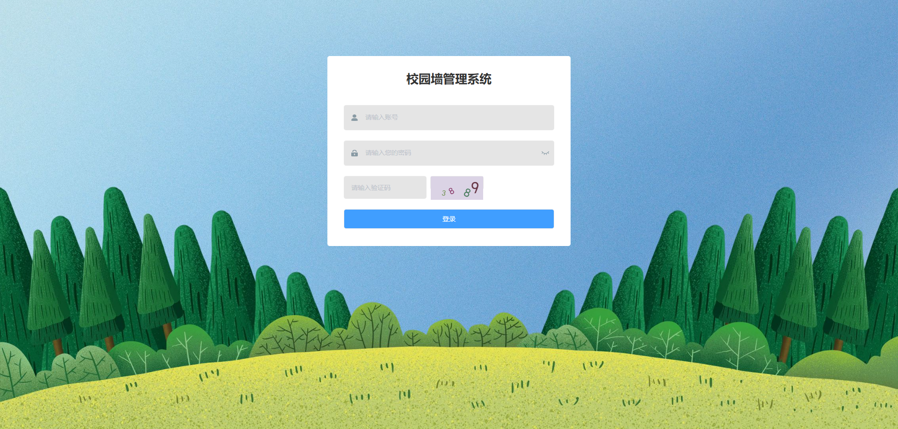

# 基于Java+Springboot+Vue校园墙小程序-毕业设计

# 获取地址

#### 作者QQ：3275035005 微信：xkbishe123 (支持修改、 部署调试、 代做接毕业设计和课程设计)

#### 网站建设、小程序、H5、APP、各种系统、样式修改、10000套源码可选。

#### 选题+开题报告+任务书+程序定制+安装调试+论文+答辩ppt 都可以做

#### 问题包修改，包满意，有需求尽管甩过来！一条龙帮你安心过！

#### 所有项目以及源代码本人均调试运行无问题 可支持远程调试运行

# 项目介绍
基于基于SpringBoot校园墙小程序-毕业设计，本系统分微信小程序和管理后台两部分，项目采用前后端分离

### 1. 用户

​	用户登录，用户注册、查看首页通知、查看首页轮播图、查看校园热门活动、查看校园活动、参加校园活动、收藏校园活动、失物招领、寻物启事、发布失物招领、发布寻物启事、查看兼职大厅、发布兼职、兼职点赞、查看二手市场、二手商品购买、二手商品发布、二手商品收藏、联系卖家、查看论坛、发布论坛、评论论坛、论坛点赞、投诉反馈、聊天中心、查看我的活动收藏、查看我的意见反馈、查看我的订单、个人信息修改、退出登录

###  2. 管理员

​	管理员登录、轮播图管理、公告管理、校园活动管理、校园活动分类管理、失物招领管理、寻物启事修改、意见反馈管理、用户信息管理、密码修改、个人信息修改、退出登录

# 技术框架
- 开发语言：Java 
- 数据库：Mysql 
- 系统环境：jdk8、maven、node
- 后端框架：SpringBoot、MyBatisplus、MyBatis
- 前端框架：Vue、Elementui、微信小程序
- 工具：IDEA、Navicat、HBuilder、微信开发者工具
- 技术架构：前后端分离、B/S架构、MVC架构
# 项目截图

### 1. 微信端

### 2. 管理端

、

